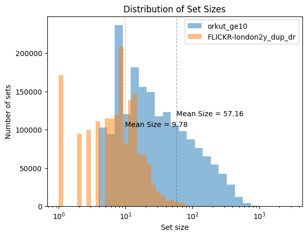
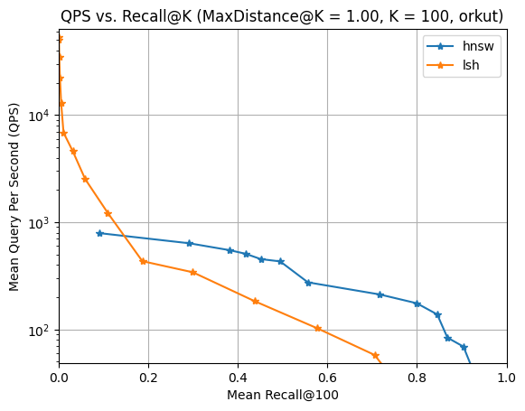
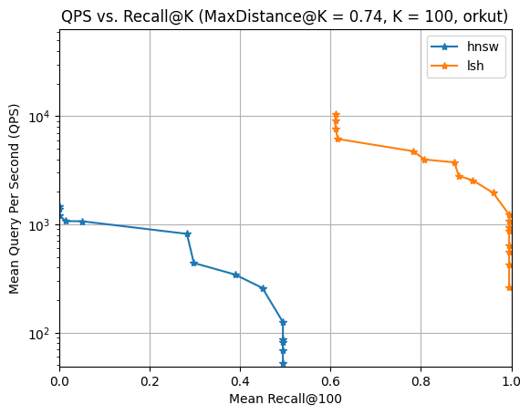
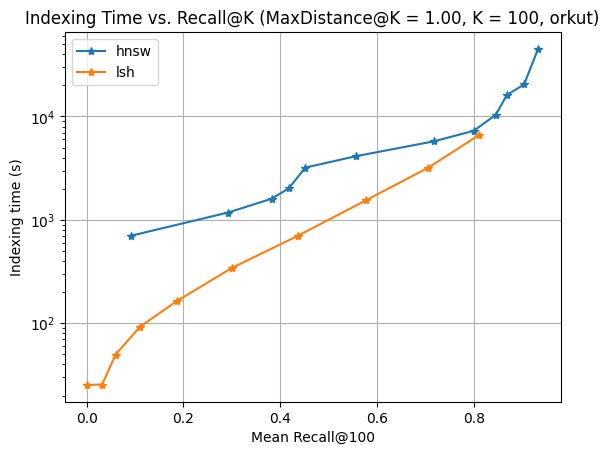
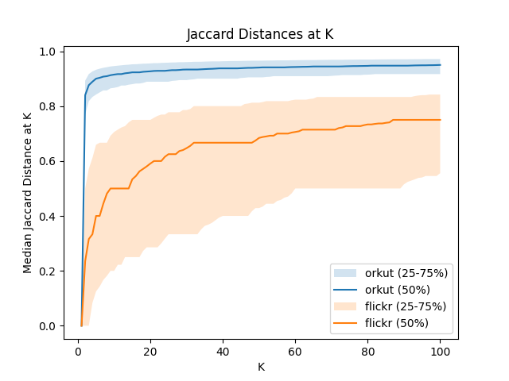

# Benchmarking ANN Indexes for Jaccard Distance

Download datasets from: [Set Similarity Search Benchmarks](https://github.com/ekzhu/set-similarity-search-benchmarks).

Use gzip to decompress the datasets.

```
gzip -d *.gz
```

## Set Size Distribution

```
python plot_set_distribution.py orkut_ge10.inp FLICKR-london2y_dup_dr.inp --output-dir plots
```



## Run Benchmarks

For example, for Orkut and Flickr datasets, run:

```
python topk_benchmark.py --index-set-file orkut_ge10.inp --query-set-file orkut_ge10.inp --query-sample-ratio 0.01 --output orkut.sqlite
python topk_benchmark.py --index-set-file FLICKR-london2y_dup_dr.inp --query-set-file FLICKR-london2y_dup_dr.inp --query-sample-ratio 0.01 --output flickr.sqlite
```

The results are stored in a SQLite database `orkut.sqlite` and `flickr.sqlite`.

## Plot Results

```
python plot_topk_benchmark.py orkut.sqlite --output-dir plots --max-distance-at-k 0.74 1.0
python plot_topk_benchmark.py flickr.sqlite --output-dir plots --max-distance-at-k 0.1 1.0
```

The plots are stored in the `plots` directory.

Query Per Second (QPS) vs. Recall for Orkut, Maximum Distance at K = 1.00 (i.e. all queries are selected).



Query Per Second (QPS) vs. Recall, Maximum Distance at K = 0.74 (i.e. only queries with all top-k results' distances greater than 0.74 are selected.).



Indexing Time vs. Recall.




## Distance Distribution

```
python plot_distance_distribution.py orkut.sqlite flickr.sqlite --output-dir plots
```



